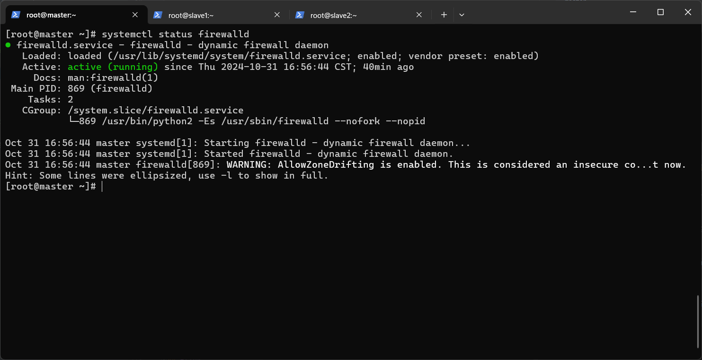

# 大数据全套笔记

# 环境搭建

> 所有用到的软件都在当前笔记的**software**目录下

## Linux前提配置

> 如果使用的是虚拟机,需要配置虚拟网络环境,建议使用vm虚拟并且网络使用NAT模式

1. 查看虚拟网络配置在**编辑 -> 虚拟网络编辑器**
2. 打开之后点击更改设置  
   
3. 点击NAT类型,选择NAT设置  
   

里面包含网关和网段信息,我们需要用在Linux配置中

使用克隆并克隆出一台主机两台副机,分别名为**master、slave1、slave2**

### 静态IP配置

> 此操作需要使用root权限使用su命令切换用户`su root`

```shell
# 使用vim编辑器进行更改内容
vim /etc/sysconfig/network-scripts/ifcfg-ens33
```

下方是源配置文件

```
TYPE="Ethernet"
PROXY_METHOD="none"
BROWSER_ONLY="no"
BOOTPROTO="dhcp"
DEFROUTE="yes"
IPV4_FAILURE_FATAL="no"
IPV6INIT="yes"
IPV6_AUTOCONF="yes"
IPV6_DEFROUTE="yes"
IPV6_FAILURE_FATAL="no"
IPV6_ADDR_GEN_MODE="stable-privacy"
NAME="ens33"
UUID="d9e82b4b-d7c0-4ad4-a44e-1b1fbfa9c598"
DEVICE="ens33"
ONBOOT="yes"
```

添加或修改的值

```
BOOTPROTO="static"      #修改为静态的
IPADDR="192.168.1.102"  #添加静态IP
NETMASK="255.255.255.0" #添加子网掩码
GATEWAY="192.168.1.2"   #添加网关
DNS1="192.168.1.2"      #配置DNS
```

添加配置完之后使用`systemctl restart network`命令重启网络

并对其他节点(主机或者副机)进行添加配置,注意IPADDR的值不能设置一样

### hosts和hostname配置

配置好ip之后可以使用ssh连接终端进行更方便快速的配置了,下图连接master节点  


打开终端输入`vim /etc/hosts`编辑命令进行hosts文件进行编辑

在文件中添加以下内容

```
192.168.1.102 master
192.168.1.103 slave1
192.168.1.104 slave2
```


配置完主机的hosts之后再配置一下主机名称

使用`vim /etc/hostname`编辑命令将里面的内容修改成

```
master
```


> 修改了主机名之后需要重启节点才可以显示更改后的名字

配置完之后再配置其他的节点hosts的内容一致,但是hostname内容分别改成slave1、slave2

由于我们使用的Windows连接的节点,最好也给Windows的hosts文件配置一下

在`C:\Windows\System32\drivers\etc\hosts`路径下

> hosts文件的作用是当你解析域名的时候,会先寻找本电脑上的hosts文件有没有对应ip如果有就返回,域名劫持攻击就是利用了hosts文件

### 配置ssh免密登录和关闭防护墙

> 在hadoop中如果不ssh设置免密登录和关闭防火墙,hadoop就不能通信

在Linux中防火墙服务的名称叫**firewalld**,使用`systemctl status firewalld`查看服务的状态



```shell
# 关闭防火墙
systemctl stop firewlld
# 设置开机不自启
systemctl disable firewlld
```

使用`ssh-keygen -t rsa`命令生成密钥,生成时需要点回车键进行确认,需要在每个节点都执行

执行完密钥生成之后就是执行密钥分发了,使用`ssh-copy-id 地址`命令在每台节点上分发到每个节点

```shell
# 所有主机
ssh-copy-id master
ssh-copy-id slave1
ssh-copy-id slave2
```

> 分发完之后,只是分发当前用户的,如果你只在当前用户分发,也只要当前用户是免密登录,如果需要可以进行多个用户分发

### 编写分发脚本和命令执行脚本

分发脚本用于向其他节点分发文件,使用shell编程

```shell
#!/bin/bash

if [ $# -eq 0 ]; then
        echo "没有文件"
        exit
fi
for i in master slave1 slave2; do
        if [ $HOSTNAME != $i ]; then
                for j in $@; do
                        filepath=$(realpath $j)
                        echo "正在上传${filepath}到$i"
                        rsync $filepath $USER@$i:$filepath
                done
        fi
done
```

命令执行脚本用于多节点执行相同的命令

```shell
#!/bin/bash

if [ $# -eq 0 ]; then
        echo "无命令"
        exit
fi

for i in master slave1 slave2; do
        echo "当前${i}正在执行${*}"
        ssh $USER@$i $*
done
```

## JavaJdk环境搭建

将java的软件包解压到`/opt/module`路径下

```shell
tar -zxvf jdk-8u202-linux-x64.tar.gz -C /opt/module
```

也可以使用命令执行脚本批量执行

```shell
/commandsync.sh tar -zxvf /opt/software/jdk-8u202-linux-x64.tar.gz -C /opt/module/
```

> 最好使用Java8的版本,因为许多框架都是基于Java8如果更换版本可以将无法启动某些框架

配置完之后需要配置JAVA_HOME来指定Java的环境变量

```shell
#在/etc/profile文件下配置，或者在/etc/profile.d/目录下新建一个.sh结尾的脚本
vim /etc/profile
```

在文件中写入Java的路径

```
JAVA_HOME=/opt/module/jdk1.8.0_202
PATH=$PATH:$JAVA_HOME/bin
```

写入完之后需要用` . /etc/profile`命令刷新下脚本,可以使用分发脚本分发/etc/profile文件到每个节点中

> .点是脚本执行的一个命令

## Hadoop环境搭建

使用命令执行脚本执行`/commandsync.sh tar -zxvf /opt/software/hadoop-3.3.1.tar.gz -C /opt/module/`
命令解压hadoop到/opt/module文件夹

~~获取hadoop的路径位置在/etc/profile中添加HADOOP_HOME环境变量~~

> 经测试 通过profile的全局环境变量会让ssh用户无法使用jps,可无视这段话

使用`vim ~/.bashrc`命令添加环境变量

```
# MyPath
export JAVA_HOME=/opt/module/jdk1.8.0_202
export PATH=$PATH:$JAVA_HOME/bin
export HADOOP_HOME=/opt/module/hadoop-3.3.1
export PATH=$PATH:$HADOOP_HOME/bin:$HADOOP_HOME/sbin
```

~~用` . /etc/profile`命令刷新下脚本~~

用` . ~/.bashrc`命令刷新下脚本

配置hadoop,分别配置六个文件

> xml配置,我恨你

1. core-site.xml
   ```xml
   <configuration>
        <property>
                <!--配置hdfs端口信息-->
                <name>fs.defaultFS</name>
                <value>hdfs://master:8020</value>
        </property>
        <property>
                <!--设置hadoop文件路径-->
                <name>hadoop.tmp.dir</name>
                <value>/opt/module/hadoop-3.3.1/data</value>
        </property>
   </configuration>
   ```
2. hdfs-site.xml
   ```xml
      <configuration>
        <property>
                <!--配置NameNode地址-->
                <name>dfs.namenode.http-address</name>
                <value>master:9870</value>
        </property>
        <property>
                <!--配置SecondaryNode地址-->
                <name>dfs.namenode.secondary.http-address</name>
                <!--如果配置到master可能无法启动，因为NameNode也在Master-->
                <value>slave1:9868</value>
        </property>
      </configuration>
   ```
3. yarn-site.xml
   ```xml
      <configuration>
        <property>
                <!--配置ResourceManager地址-->
                <name>yarn.resourcemanager.hostname</name>
                <value>master</value>
        </property>
        <property>
                <!--配置ResourceManager网络地址-->
                 <name>yarn.resourcemanager.webapp.address</name>
                <value>master:8088</value>
        </property>
        <property>
                <name>yarn.nodemanager.aux-services</name>
                <value>mapreduce_shuffle</value>
        </property>
      </configuration>
   ```
4. mapred-site.xml
   ```xml
   <configuration>
        <property>
                <!--配置mapreduce为yarn-->
                <name>mapreduce.framework.name</name>
                <value>yarn</value>
        </property>
   </configuration>
   ```
5. workers

   在workers文件中配置节点地址
   ```
   master
   slave1
   slave2
   ```
6. hadoop-env.sh

   按需求配置如果启动报错缺少什么什么就来这个文件配置

配置完毕之后要先执行`hdfs namenode -format`进行hdfs数据初始化

初始化完毕之后便可以启动了

启动hdfs`start-dfs.sh`启动yarn`start-yarn.sh`

关闭hdfs`stop-dfs.sh`关闭yarn`stop-yarn.sh`

### 其他配置

在工作完之后,并没有运行历史记录,这就要配置一下历史服务器了

在mapred-site.xml中配置以下内容

```xml

<configuration>
    <property>
        <name>mapreduce.framework.name</name>
        <value>yarn</value>
    </property>
    <property>
        <name>mapreduce.jobhistory.address</name>
        <value>master:10020</value>
    </property>
    <property>
        <name>mapreduce.jobhistory.webapp.address</name>
        <value>master:19888</value>
    </property>
</configuration>
```

分发之后就可以使用`mapred --daemon start historyserver`命令进行启动了

为了更方便的查看节点上的日志功能,建议开启日志聚集服务器,在**yarn-site.xml**配置文件中配置以下内容

```
<configuration>
    <property>
        <name>yarn.resourcemanager.hostname</name>
        <value>master</value>
    </property>
    <property>
        <name>yarn.resourcemanager.webapp.address</name>
        <value>master:8088</value>
    </property>
    <property>
        <name>yarn.nodemanager.aux-services</name>
        <value>mapreduce_shuffle</value>
    </property>
    <property>
        <!--开启日志聚集功能-->
        <name>yarn.log-aggregation-enable</name>
        <value>true</value>
    </property>
    <property>
        <!--设置日志聚集地址-->
        <name>yarn.log.server.url</name>
        <value>http://master:19888/jobhistory/logs</value>
    </property>
    <property>
        <!--设置保留日志为七天-->
        <name>yarn.log-aggregation.retain-seconds</name>
        <value>604800</value>
    </property>
</configuration>
```

### 编写启动集群脚本

如果我们每次一个一个的启动会太麻烦了,但是我们编写一个集群启动脚本就很方便了,以下是shell编程

```shell
#!/bin/bash

if [ $# -eq 0 ]; then
    echo "你未输入参数"
    exit
fi

case $1 in
  "start")
  echo "启动hdfs"
  start-dfs.sh
  echo "启动yarn"
  start-yarn.sh
  echo "启动historyserver"
  mapred --daemon start historyserver
  ;;
  "stop")
  echo "关闭hdfs"
  stop-dfs.sh
  echo "关闭yarn"
  stop-yarn.sh
  echo "关闭historyserver"
  mapred --daemon stop historyserver
  ;;
  "restart")
  echo "关闭hdfs"
  stop-dfs.sh
  echo "关闭yarn"
  stop-yarn.sh
  echo "关闭historyserver"
  mapred --daemon stop historyserver
  echo "启动hdfs"
  start-dfs.sh
  echo "启动yarn"
  start-yarn.sh
  echo "启动historyserver"
  mapred --daemon start historyserver
  ;;
  *)
    echo "参数不是start/stop/restart" 
  ;;
esac
```

## Hive环境搭建

使用`tar -zxvf /opt/software/apache-hive-3.1.3-bin.tar.gz -C /opt/module/`解压

在 **/etc/profile**配置hive环境变量

```shell
export HIVE_HOME=/opt/module/apache-hive-3.1.3-bin
```

配置完之后在hive的主目录下的conf文件夹中新建一个**hive-site.xml**文件,添加以下内容,注意在hive的lib文件夹中添加mysql连接器,
本笔记中的jars文件夹中有一个**mysql-connector-java-8.0.25**版本的

> 在/opt/module/apache-hive-3.1.3-bin/conf/这里新建

```
<configuration>
   <property>
      <!--设置连接的mysql地址-->
      <name>javax.jdo.option.ConnectionURL</name>
      <value>jdbc:mysql://123.56.82.129/hive</value>
   </property>
   <property>
      <!--设置连接的驱动类-->
      <name>javax.jdo.option.ConnectionDriverName</name>
      <value>com.mysql.cj.jdbc.Driver</value>
   </property>
   <property>
      <!--设置连接的用户名-->
      <name>javax.jdo.option.ConnectionUserName</name>
      <value>root</value>
   </property>
   <property>
      <!--设置连接的密码-->
      <name>javax.jdo.option.ConnectionPassword</name>
      <value>123456</value>
   </property>
   <property>
      <!--设置创建表的默认路径-->
      <name>hive.metastore.warehouse.dir</name>
      <value>/hive/warehouse</value>
   </property>
</configuration>
```

配置完之后进行hive数据库的初始化,使用`schematool -dbType mysql -initSchema -verbose`命令进行初始化

初始化之后便可以用`hive`命令启动hive

启动hive之后就尝试输入一些命令来查看是否可以运行,创建数据库`create database myhive;`
,创建一张简单的表`create table test(id int,name string);`再尝试插入一条数据`insert into test value(1,'zs');`

如果插入数据失败时候,可能是mapreduce配置错误或版本不对,在此笔记上方的**mapred-site.xml**配置并没有添加这些内容

```
<configuration>
        <property>
                <name>mapreduce.framework.name</name>
                <value>yarn</value>
        </property>
        <property>
                <name>mapreduce.jobhistory.address</name>
                <value>master:10020</value>
        </property>
        <property>
                <name>mapreduce.jobhistory.webapp.address</name>
                <value>master:19888</value>
        </property>
        <property>
                <!--配置mapred的环境位置-->         
                <name>yarn.app.mapreduce.am.env</name>
                <value>HADOOP_MAPRED_HOME=/opt/module/hadoop-3.3.1</value>
        </property>
        <property>
                <!--配置map的路径-->         
                <name>mapreduce.map.env</name>
                <value>HADOOP_MAPRED_HOME=/opt/module/hadoop-3.3.1</value>
        </property>
        <property>
                <!--配置reduce的路径-->         
                <name>mapreduce.reduce.env</name>
                <value>HADOOP_MAPRED_HOME=/opt/module/hadoop-3.3.1</value>
        </property>
</configuration>
```

添加之后分发,再尝试插入数据,如果显示下图这样或者在yarnweb上看到进度完成就代表执行成功了


> 在hive中mysql只是存储hive的元数据,真正的数据内容是存储在hadoop的hdfs中

在hive中还有两个服务,他们在hive中起到了关键的作用

### **hiveserver2**服务

hiveserver2服务提供了远程访问数据的功能,当使用用户访问的时候,就需要一个代理用户,我们可以在hadoop中的core-site.xml文件中进行配置

```
<configuration>
        <property>
                <name>fs.defaultFS</name>
                <value>hdfs://master:8020</value>
        </property>
        <property>
                <name>hadoop.tmp.dir</name>
                <value>/opt/module/hadoop-3.3.1/data</value>
        </property>
        <property>
                <!--配置afei用户可以作为代理用户-->         
                <name>hadoop.proxyuser.afei.hosts</name>
                <value>*</value>
        </property>
        <property>
                <!--配置afei用户能够代理任意组-->         
                <name>hadoop.proxyuser.afei.groups</name>
                <value>*</value>
        </property>
        <property>
                <!--配置afei用户能够代理任意用户-->         
                <name>hadoop.proxyuser.afei.users</name>
                <value>*</value>
        </property>
</configuration>
```

不要忘记分发到其他节点(●'◡'●)

配置完之后还要去配置hive的的配置文件╰(‵□′)╯,配置hive-site.xml文件

```
<configuration>
        <property>
                <name>javax.jdo.option.ConnectionURL</name>
                <value>jdbc:mysql://123.56.82.129/hive</value>
        </property>
        <property>
                <name>javax.jdo.option.ConnectionDriverName</name>
                <value>com.mysql.cj.jdbc.Driver</value>
        </property>
        <property>
                <name>javax.jdo.option.ConnectionUserName</name>
                <value>root</value>
        </property>
        <property>
                <name>javax.jdo.option.ConnectionPassword</name>
                <value>afeibaili233</value>
        </property>
        <property>
                <name>hive.metastore.warehouse.dir</name>
                <value>/hive/warehouse</value>
        </property>
        <property>
                <!--指定hiveserver2的地址-->
                <name>hive.server2.thrift.bind.host</name>
                <value>master</value>
        </property>
        <property>
                <!--指定hiveserver2的端口-->
                <name>hive.server2.thrift.port</name>
                <value>10000</value>
        </property>
</configuration>
```

配置完hiveserver2就可以使用hive/bin下的**beeline**命令来打开自带的客户端,打开之后的样子


在>beeline中输入`!connect jdbc:hive2://master:10000`回车之后输入配置的用户名和密码

> 由于没开启密码校验,可以不输密码
> 注意ctrl+z会把进程暂停与后台而不是后台运行,后台运行hiveserver2使用`nohup bin/hiveserver2 > /dev/null &`
> 命令,/del/null文件代表空文件

通过idea数据库连接hive


选择hive数据库


配置完主机地址和用户名便可以连接了


### **metastore**服务

metastore服务的作用是为 Hive CLI 或者 Hiveserver2 提供元数据访问接口,
hiveserver2 是客户端连接的入口，而 metastore 是 hive 查询时的元数据提供者,
默认是开启的是嵌入式模式,开启独立运行模式可以减少元数据数据库的访问压力

配置**hive-site.xml**配置文件

```
<configuration>
        <property>
                <name>javax.jdo.option.ConnectionURL</name>
                <value>jdbc:mysql://123.56.82.129/hive</value>
        </property>
        <property>
                <name>javax.jdo.option.ConnectionDriverName</name>
                <value>com.mysql.cj.jdbc.Driver</value>
        </property>
        <property>
                <name>javax.jdo.option.ConnectionUserName</name>
                <value>root</value>
        </property>
        <property>
                <name>javax.jdo.option.ConnectionPassword</name>
                <value>afeibaili233</value>
        </property>
        <property>
                <name>hive.metastore.warehouse.dir</name>
                <value>/hive/warehouse</value>
        </property>
        <property>
                <name>hive.server2.thrift.bind.host</name>
                <value>master</value>
        </property>
        <property>
                <name>hive.server2.thrift.port</name>
                <value>10000</value>
        </property>
        <property>
                <!--配置metastore的通讯地址-->
                <name>hive.metastroe.uris</name>
                <value>thrift://master:9083</value>
        </property>
</configuration>
```

配置完之后便可以启动metastore服务了`nohup /hive/bin/hive --service metastore > /dev/null &`

## Spark环境搭建

Spark是一个离线批处理框架,使用`tar -zxvf /opt/software/spark-3.4.3-bin-hadoop3.tgz /opt/module/`命令解压spark到/opt/module/中

配置yarn的运行模式,打开spark的conf文件夹,更改配置文件名称**spark-env.sh.template -> spark-env.sh**

配置**spark-env.sh**文件,添加以下内容

```shell
# 配置yarn的配置文件路径
YARN_CONF_DIR=/opt/module/hadoop-3.3.1/etc/hadoop/
```

> yarn模式是基于yarn的无须其他配置

配置完之后并分发配置文件,尝试运行以下命令运行,提交一个运行例子

```
bin/spark-submit --class org.apache.spark.examples.SparkPi --master yarn /spark/examples/jars/spark-examples_2.12-3.4.3.jar  10
```

### 配置spark历史服务器

在spark的conf文件夹中的 **spark-defaults.conf.template重命名为spark-defaults.conf**
并添加以下内容

```
# 开启spark日志服务
spark.eventLog.enabled           true
# 配置hdfs日志文件路径,在hdfs文件系统中必须包含此文件夹
spark.eventLog.dir               hdfs://master:8020/spark
# 配置历史服务器主机节点和端口
spark.yarn.historyServer.address=hadoop102:18080
# 配置端口
spark.history.ui.port=18080
```

再次配置**spark-env.sh**文件,添加以下内容

```shell
YARN_CONF_DIR=/opt/module/hadoop-3.3.1/etc/hadoop/

# 配置spark历史服务选项
export SPARK_HISTORY_OPTS="
-Dspark.history.ui.port=18080
-Dspark.history.fs.logDirectory=hdfs://hadoop102:8020/spark
-Dspark.history.retainedApplications=30"
```

## Flink环境搭建

Flink是一个实时流处理框架

解压文件`sudo /commandsync.sh tar -zxvf /opt/software/flink-1.17.2-bin-scala_2.12.tgz -C /opt/module/`

修改集群配置,在flink/conf/中的**flink-conf.yaml**中修改以下配置

```yaml
# JobManager节点地址
jobmanager.rpc.address: master
jobmanager.bind-host: 0.0.0.0
rest.address: master
rest.bind-address: 0.0.0.0

# TaskManager节点地址
taskmanager.bind.host: 0.0.0.0
taskmanager.host: master
```

配置**workers**文件,添加以下内容

```
master
slave1
slave2
```

配置**masters**文件,修改为以下内容

```
master:8081
```

修改之后将配置文件分发下去,并修改**flink-conf.yaml**中的**taskmanager.host: master**
修改为**taskmanager.host: 当前主机地址名称**

输入`bin/start-cluster.sh`以Standalone模式启动flink集群

> Standalone模式,既是单机运行模式,不依赖其他资源,在真正运行中,建议使用yarn模式

### yarn模式部署

配置环境变量在 **/etc/profile** 中配置

```shell
# 前提配置HADOOP_HOME和PATH,配置hadoop配置文件路径
export HADOOP_CONF_DIR=${HADOOP_HOME}/etc/hadoop
# 配置hadoop classpath
export HADOOP_CLASSPATH=`hadoop classpath`
```

> \`hadoop classpath\` 反引号代表执行里面的内容,
> ${HADOOP_HOME}/etc/hadoop ${}代表读取里面的变量

基于yarn模式运行要先启动hadoop集群

在flink文件夹中输入`bin/yarn-session`启动yarn的会话模式,启动之后在yarn任务中会有一个任务正在进行


单作业模式可以直接启动flink集群,使用`flink run`命令

| 参数 | 描述          |
|----|-------------|
| -t | 指定运行模式      |
| -c | 指定全类名       |
| -d | 分离模式,防止终端阻塞 |
| -D | 指定yarnId    |

> 分离模式可能抛出一个检查类加载器的异常

```shell
bin/flink run -t yarn-per-job -c com.afeibaili.FlinkDemo FlinkDemo.jar
```

我们可以使用以下命令查看运行或取消运行作业

```shell
# 查看运行任务
bin/flink list -t yarn-per-job -Dyarn.application.id=application_XXX_XXX
# 根据运行任务Id取消任务
bin/flink cancel -t yarn-per-job -Dyarn.application.id=application_XXX_XXX <JobID>
```

应用模式和但作业模式类似,但有些区别

```shell
# 他们的区别 run -> run-application，yarn-per-job -> yarn-application
bin/flink run-application -t yarn-application -c com.afeibaili.FlinkDemo FlinkDemo.jar
```

> 单作业模式为每个任务都开启一个集群,开销比较大 应用程序模式只开启一个集群

还可以把包放到hdfs上进行运行,把flink的lib文件夹和plugins放到hdfs,通过以下参数命令进行运行

> lib和plugins放到一个文件夹中

```shell
# 前面两个参数就不多说了，-Dyarn.provided.lib.dirs 指定hdfs上库的位置，后面跟上全类名和jar包在hdfs上的位置
bin/flink run-application -t yarn-application -Dyarn.provided.lib.dirs="hdfs://master:8020/flink" -c com.afeibaili.FlinkDemo hdfs://master:8020/flink/jar/FlinkDemo.jar
```

### flink历史服务器配置

配置**flink/conf/flink-conf.yaml**文件,修改以下配置参数

注意创建hdfs服务器上的文件夹

```yaml
jobmanager.archive.fs.dir: hdfs://master:8020/flink/log
historyserver.web.address: master
historyserver.web.port: 8082
historyserver.archive.fs.dir: hdfs://master:8020/flink/log
historyserver.archive.fs.refresh-interval: 10000
```


使用`bin/historyserver.sh start`启动flink历史服务器,start更换stop为关闭历史服务器

## Kafka环境搭建

kafka是一款高吞吐,高可用消息队列,kafka有两种部署模式,一种是**Zookeeper**,另一种是**KRaft**部署模式

### zookeeper环境搭建

使用命令`tar -zxvf /opt/software/apache-zookeeper-3.8.1-bin.tar.gz -C /opt/module/`解压

解压之后创建数据文件夹在zookeeper文件夹中


在创建的文件夹中添加一个名为myid的文件里面只写一个1,代表节点1,可以通过命令快捷生成`echo "1" > /opt/module/apache-zookeeper-3.8.1-bin/data/myid`

打开zookeeper的配置文件夹,找到**zoo_sample.cfg**命名为**zoo.cfg**并配置以下内容

```
# 配置zookeeper的数据路径
dataDir=/opt/module/apache-zookeeper-3.8.1-bin/data

# 配置zookeeper的节点端口和选举端口(选举管理用的)
server.1=master:2888:3888
server.2=slave1:2888:3888
server.3=slave2:2888:3888
```


然后分发集群并修改`data/myid`文件的节点,master为1,slave1修改为2,slave2修改为3

修改完之后便可以启动zookeeper了,启动zookeeper需要在每台主机上都启动,写一个启动脚本会方便许多

```shell
#!/bin/bash

case $1 in
"start")
        echo "zookeeper开启"
        /commandsync.sh /opt/module/apache-zookeeper-3.8.1-bin/bin/zkServer.sh start
;;
"stop")
        echo "zookeeper关闭"
        /commandsync.sh /opt/module/apache-zookeeper-3.8.1-bin/bin/zkServer.sh stop
;;
"restart")
        echo "zookeeper关闭"
        /commandsync.sh /opt/module/apache-zookeeper-3.8.1-bin/bin/zkServer.sh stop
        echo "zookeeper开启"
        /commandsync.sh /opt/module/apache-zookeeper-3.8.1-bin/bin/zkServer.sh start
;;
"status")
        echo "zookeeper状态"
        /commandsync.sh /opt/module/apache-zookeeper-3.8.1-bin/bin/zkServer.sh status
;;
*)
        echo "请输入(start|stop|restart|status)"
;;
esac
```

启动命令`bin/zkServer.sh start`,关闭命令`bin/zkServer.sh stop`,更改为start status变成查看运行状态

### 基于zookeeper的kafka环境搭建

搭建好zookeeper后解压kafka安装包`tar -zxvf /opt/software/kafka_2.12-3.8.1.tgz -C /opt/module/`

解压之后开始配置**kafka/config/server.properties**文件,更改以下内容

```
# 更改id为zookeeper配置myid,统一起来
broker.id=1
# 更改对外暴露的地址端口
advertised.listeners=PLAINTEXT://master:9092
# 配置持久化路径
log.dirs=/opt/module/kafka_2.12-3.8.1/data
# 配置zookeeper连接
zookeeper.connect=master:2181,slave1:2181,slave2:2181
```

分发之后,更改其他节点的配置文件信息**broker.id**和**advertised.listeners**

启动kafka`bin/kafka-server-start.sh --daemon config/server.properties`命令和关闭kafka`bin/kafka-server-stop.sh`命令,
分别在集群启动kafka很麻烦,可以编写一个启动脚本,用于快速启动kafka

```shell
#!/bin/bash

case $1 in
"start")
        echo "zookeeper开启"
        /commandsync.sh /opt/module/apache-zookeeper-3.8.1-bin/bin/zkServer.sh start
        echo "kafka开启"
        /commandsync.sh /opt/module/kafka_2.12-3.8.1/bin/kafka-server-start.sh -daemon /opt/module/kafka_2.12-3.8.1/config/server.properties
;;
"stop")
        echo "kafka关闭"
        /commandsync.sh /opt/module/kafka_2.12-3.8.1/bin/kafka-server-stop.sh
        echo "zookeeper关闭"
        /commandsync.sh /opt/module/apache-zookeeper-3.8.1-bin/bin/zkServer.sh stop
;;
"restart")
        echo "kafka关闭"
        /commandsync.sh /opt/module/kafka_2.12-3.8.1/bin/kafka-server-stop.sh
        echo "zookeeper关闭"
        /commandsync.sh /opt/module/apache-zookeeper-3.8.1-bin/bin/zkServer.sh stop
                echo "zookeeper开启"
        /commandsync.sh /opt/module/apache-zookeeper-3.8.1-bin/bin/zkServer.sh start
        echo "kafka开启"
        /commandsync.sh /opt/module/kafka_2.12-3.8.1/bin/kafka-server-start.sh -daemon /opt/module/kafka_2.12-3.8.1/config/server.propertie
;;
*)
        echo "请输入(start|stop|restart)"
;;
esac
```

走到这里就是配置成功了可以用 IDEA BigData 插件来尝试连接